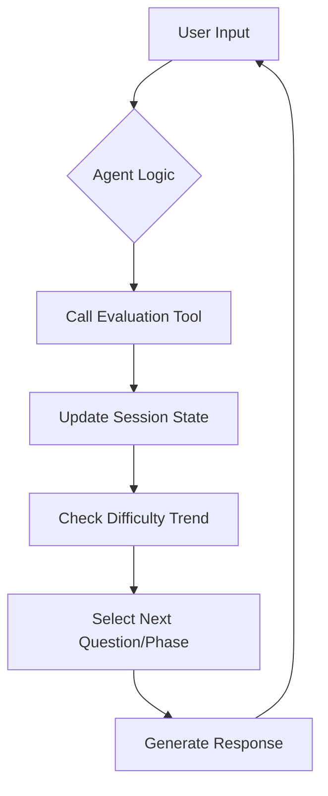
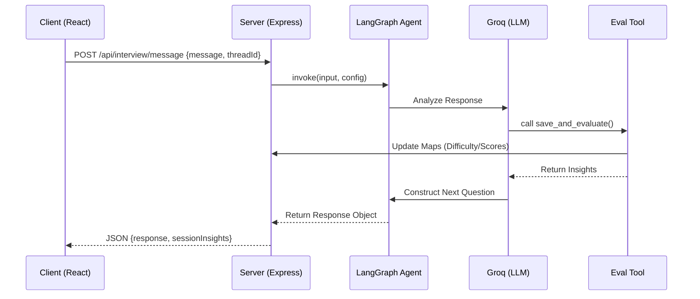

# DeepHire Agent Architecture

This document details the technical implementation of the AI Interviewer and its underlying agentic architecture.

## 1. High-Level Overview
The DeepHire Interviewer is a **Stateful ReAct Agent** built on **LangGraph**. It manages a dynamic technical interview by reasoning through candidate responses, evaluating them against a scoring rubric, and adapting the interview path (difficulty and topic focus) in real-time.

---

## 2. Technology Stack
- **Orchestration**: [LangGraph](https://github.com/langchain-ai/langgraphjs) (Stateful graph-based agents)
- **LLM Engine**: [Groq](https://groq.com/) (Llama 3.1 8B Instant) — chosen for low-latency performance.
- **Framework**: LangChain.js
- **State Persistence**: `MemorySaver` (Checkpointing)
- **Schema Validation**: Zod (for structured tool output)
- **PDF Extraction**: `pdf-parse` (v2.0)

---

## 3. The Agent Loop (ReAct Pattern)
The agent follows the **Reasoning and Acting (ReAct)** pattern. Instead of generating a response immediately, it follows this loop:

1.  **Input**: Receives candidate's STT (Speech-to-Text) transcript.
2.  **Reason**: Analyzes the message against the session history and system prompt.
3.  **Act**: Invokes the `save_and_evaluate` tool to process the answer.
4.  **Observe**: Receives the evaluation result (score, difficulty adjustment, insights).
5.  **Output**: Generates a natural, spoken-style response or next question based on the evaluation.

---

## 4. State Management
The system maintains two types of state:
1.  **Conversation State**: Managed by LangGraph's `checkpointSaver`, preserving the raw message history for context.
2.  **Technical State**: Managed via an in-memory `Map` (keyed by `threadId`) in `InterviewController.js`.

### Session Metadata (`sessionStates`)
| Property | Description |
| :--- | :--- |
| `currentDifficulty` | A value from 1 (Basic) to 5 (Architectural). |
| `skillsObserved` | A frequency map of technical skills validated. |
| `followUpQueue` | A list of specific points that need clarification. |
| `readiness` | Overall candidate sentiment (Low, Medium, High). |

---

## 5. Adaptive Logic
The agent adjusts the interview "vibe" and technical depth using two primary mechanisms:

### A. Difficulty Scaling
The `getNextDifficulty` function implements a sliding window logic:
- **Promotion**: If the average score of the last 2 answers is >= 8, difficulty increases by 1.
- **Demotion**: If the average score is < 5, difficulty decreases by 1.
- **Boundary**: Clamped between 1 and 5.

### B. Follow-Up Probing
If a candidate provides a shallow or generic answer, the `save_and_evaluate` tool flags `followUpNeeded: true`. This forces the agent to ask a clarifying question rather than moving to a new topic, simulating a real senior interviewer.

---

## 6. Resume Integration
DeepHire uses a "Resume-First" strategy.

1.  **Parsing Phase**: `ResumeController` uses an LLM to transform a raw PDF into a JSON schema (experience, specific tech stack, project highlights).
2.  **Prompt Engineering**: On the first turn, `buildResumeSystemMessage` injects this JSON into the agent's system prompt.
3.  **Contextual Awareness**: The agent is instructed to start with Behavioral questions tied *directly* to the candidate's work history before moving to Technical validation of their stated skills.

---

## 7. Tool Definition: `save_and_evaluate`
The single source of truth for evaluation. It takes parameters like `score`, `skillsDemonstrated`, `difficultyAssigned`, and `followUpNeeded`.

---

## 8. Data Flow Diagram

